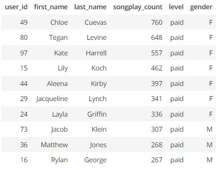
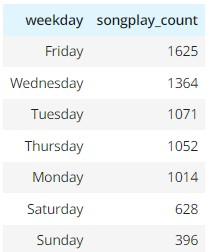
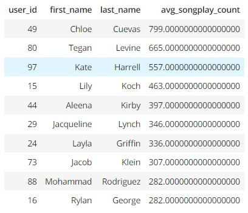

# Project: Data Modelling with Postgres 

## Project Summary

A fictitious startup called Sparkify wants to analyze the data they've been collecting on songs and user activity on their new music streaming app. The Sparkify analytics team is particularly interested in understanding what songs their users are listening to. Currently, they don't have an easy way to query their data, which resides in a directory of JSON logs on user activity on the app, as well as a directory with JSON metadata on the songs in their app.

As data engineer hired for the project, the role includes:

1. create a Postgres database with tables designed to optimize queries on song play analysis, 
2. create a database schema by defining fact and dimension tables for a star schema and 
3. build an ETL pipeline that transfers data from files in two local directories into these tables in Postgres using Python and SQL

One of the goals is to be able to test the database and ETL pipeline by running queries provided by the analytics team from Sparkify and compare the results with their expected results.

## Project Datasets

There are two datasets for this project: song dataset and log dataset.
* Song Dataset
    - The song dataset is a subset of real data from the *Million Song Dataset*. The *Million Song Dataset* is a freely available collection of audio features and metadata for a million contemporary popular music tracks. Each file is in JSON format and contains metadata about a song and the artist of that song. 


* Log Dataset
    - The log dataset consists of log files in JSON format generated by this event simulator based on the songs in the dataset above. These simulate activity logs from a music streaming app based on specified configurations.


## Project Files

The following project files are created:

1.	**test.ipynb** displays the first few rows of each table. This is to check the database that the records are loaded successfully.


2.	**create_tables.py** drops and creates the tables. This needs to be run in order to reset the tables before each time the ETL script is run.


3.	**etl.ipynb** reads and processes a single file from song_data and log_data and loads the data into the tables. This notebook contains detailed instructions on the ETL process for each of the tables.


4.	**etl.py** reads and processes files from song_data and log_data and loads them into the tables. 


5.	**sql_queries.py** contains all the sql queries, and is imported into create_tables.py, etl.ipynb and etl.py.


6. **data** folder that contains the song and log datasets in json files which will be processed through the python scripts and notebooks

## Running the Python Scripts and how it works

**Steps:**

1. In sql_queries.py, the following will be written:

    * CREATE statements to create each table
    * DROP statements to drop tables if exist
    * INSERT statements to insert records into respective tables
    * song_select query to find the song ID and artist ID based on the title, artist name, and duration of a song
    
    
2. Run create_tables.py to create the database and tables.

    - launch the terminal and run the script as below: 
            python create_tables.py
            
3. Run test.ipynb to confirm the creation of the tables with the correct columns. Make sure to click "Restart kernel" to close the connection to the database after running this notebook. Otherwise, the codes in create_tables.py, etl.py, or etl.ipynb files won't run since multiple connections to the same database (in this case, sparkifydb) is not possible.


4. Develop ETL processes for each table using etl.ipynb notebook. At the end of each table section, or at the end of the notebook, run test.ipynb to confirm that records were successfully inserted into each table. Remember to rerun create_tables.py to reset the tables before each time this notebook is run.


5. Build the ETL pipeline using etl.py script where the entire datasets will be processed. 


6. Run etl.py to process the datasets. Remember to run create_tables.py before running etl.py to reset the tables. Run test.ipynb to confirm that the records were successfully inserted into each table.

    - launch the terminal and run the script as below: 
            python etl.py

## Database Schema

The following image is the database schema created, a *star schema* which simplifies the queries and fast aggregations can be performed. It shows the relationship between the fact table (songplays) and four dimension tables as well as the data types used for each column.


## ETL (Extract, Transform, Load) Process

ETL is the approach that will be used for describing data flows. ETL is the more traditional approach for warehousing and smaller-scale analytics but has also become common with big data projects. In ETL, data is transformed before loading into the database storage.

The etl.ipynb notebook details the ETL process for each of the tables.

**I. Process song_data dataset to create songs and artists dimensional tables**

    - Use the get_files function to get a list of all song JSON files in data/song_data
    - Select the first song in this list
    - Read the song file and view the data
    
**A. ETL for songs table**

**1. Extract data for songs table**

    - Select columns for song ID, title, artist ID, year, and duration
    - Use df.values to select just the values from the dataframe
    - Index to select the first (only) record in the dataframe
    - Convert the array to a list and set it to song_data
    
**2. Insert record into songs table**

    - Implement the song_table_insert query in sql_queries.py
    - Run the commands cur.execute(song_table_insert, song_data) and conn.commit() to insert a record for this song into the songs table.
    
**B. ETL for artists table**

**1. Extract data for artists table**

    - Select columns for artist ID, name, location, latitude, and longitude
    - Use df.values to select just the values from the dataframe
    - Index to select the first (only) record in the dataframe
    - Convert the array to a list and set it to artist_data
 
**2. Insert record into artists table**

    - Implement the artist_table_insert query in sql_queries.py
    - Run the commands cur.execute(artist_table_insert, artist_data) and conn.commit() to insert a record for this song's artist into the artists table
    
    
    
    
**II. Process log_data dataset to create the time and users dimensional tables, as well as the songplays fact table.**

    - Use the get_files function provided above to get a list of all log JSON files in data/log_data
    - Select the first log file in this list
    - Read the log file and view the data
    
**A. ETL for time table**

**1. Extract data for time table**

    - Filter records by NextSong action
    - Convert the ts timestamp column to datetime (Hint: the current timestamp is in milliseconds)
    - Extract the timestamp, hour, day, week of year, month, year, and weekday from the ts column and set time_data to a list containing these values in order
    - Specify labels for these columns and set to column_labels
    - Create a dataframe, time_df, containing the time data for this file by combining column_labels and time_data into a dictionary and converting this into a dataframe

**2. Insert record into time table**

    - Implement the time_table_insert query in sql_queries.py
    - Run the code below to insert records for the timestamps in this log file into the time table
    
        ```for i, row in time_df.iterrows():
            cur.execute(time_table_insert, list(row))
            conn.commit()```
    
**B. ETL for users table**

**1. Extract data for users table**

    - Select columns for user ID, first name, last name, gender and level and set to user_df
    
**2. Insert record into users table**

    - Implement the user_table_insert query in sql_queries.py
    - Run the code below to insert records for the users in this log file into the users table
    
        ```for i, row in user_df.iterrows():
            cur.execute(user_table_insert, row)
            conn.commit()```
    
**C. ETL for songplays table**

**1. Extract data for songplays table**
This one is a little more complicated since information from the songs table, artists table, and original log file are all needed for the songplays table. Since the log file does not specify an ID for either the song or the artist, you'll need to get the song ID and artist ID by querying the songs and artists tables to find matches based on song title, artist name, and song duration time.

    - Implement the song_select query in sql_queries.py to find the song ID and artist ID based on the title, artist name, and duration of a song
    - Select the timestamp, user ID, level, song ID, artist ID, session ID, location, and user agent and set to songplay_data
    
**2. Insert record into songplays table**

    - Implement the songplay_table_insert query 
    - Run the codes below to insert records for the songplay actions in this log file into the songplays table
    
        ```for index, row in df.iterrows():

            cur.execute(song_select, (row.song, row.artist, row.length))
            results = cur.fetchone()
    
            if results:
                songid, artistid = results
            else:
                songid, artistid = None, None

            songplay_data = (pd.to_datetime(row.ts, unit = 'ms'), row.userId, row.level, songid, artistid, row.sessionId, row.location, row.userAgent)
            cur.execute(songplay_table_insert, songplay_data)
            conn.commit()```
            
The ETL pipeline is then built through etl.py script.

    

## Analysis of songplays and Example Queries

Based on the database created, the values extracted for songplays table contain empty song_id's and artist_id's. There is only actually one record which has the song_id and artist_id. In this regard, queries and analysis of songplays will be limited. It is not possible to query something like top performing artists or most played songs.

Here are some of the queries performed using the new database:

**Sample Query 1 - In terms of the number of songplays, which users are the most active, paid or free users, and what gender?**


```python
%sql SELECT songplays.user_id, first_name, last_name, COUNT(*) as songplay_count, songplays.level, users.gender \
FROM users JOIN songplays ON songplays.user_id = users.user_id \
GROUP BY songplays.user_id, first_name, last_name, songplays.level, users.gender \
ORDER BY songplay_count DESC LIMIT 10;
```



**Sample Query 2 - Which day of the week the users are most active?**


```python
%sql SELECT weekday, COUNT(*) as songplay_count FROM time JOIN songplays ON time.start_time = songplays.start_time \
GROUP BY weekday ORDER BY songplay_count DESC;
```



**Sample Query 3 - How many users are free and how many are paid?**


```python
%sql SELECT level, COUNT(*) num_users FROM users GROUP bY level;
```


**Sample Query 4 - What is the average number of songplays the top 10 most active users listen to?**


```python
%sql SELECT user_id, first_name, last_name, AVG(songplay_count) as avg_songplay_count \
FROM (SELECT songplays.user_id, first_name, last_name, COUNT(songplay_id) as songplay_count \
      FROM songplays JOIN users ON songplays.user_id = users.user_id \
      GROUP BY songplays.user_id, first_name, last_name) as t \
GROUP BY user_id, first_name, last_name ORDER BY avg_songplay_count DESC LIMIT 10;
```




```python

```
